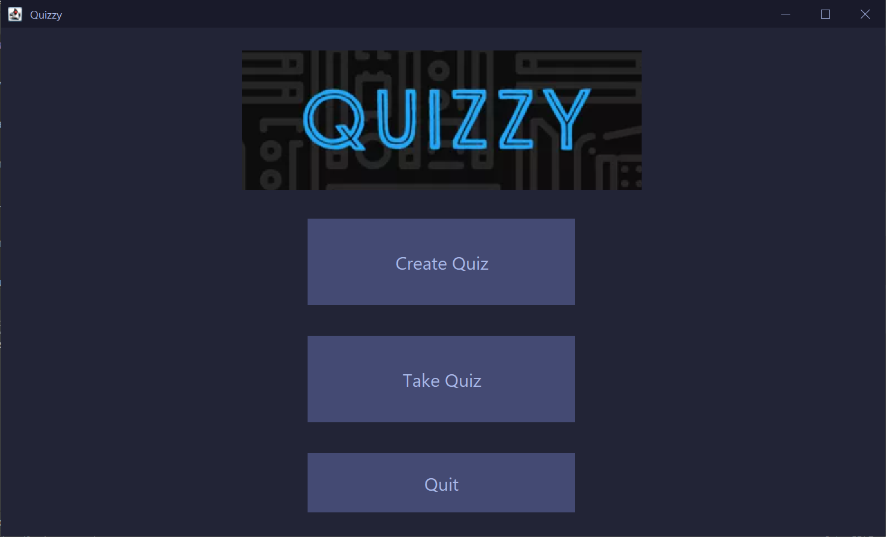
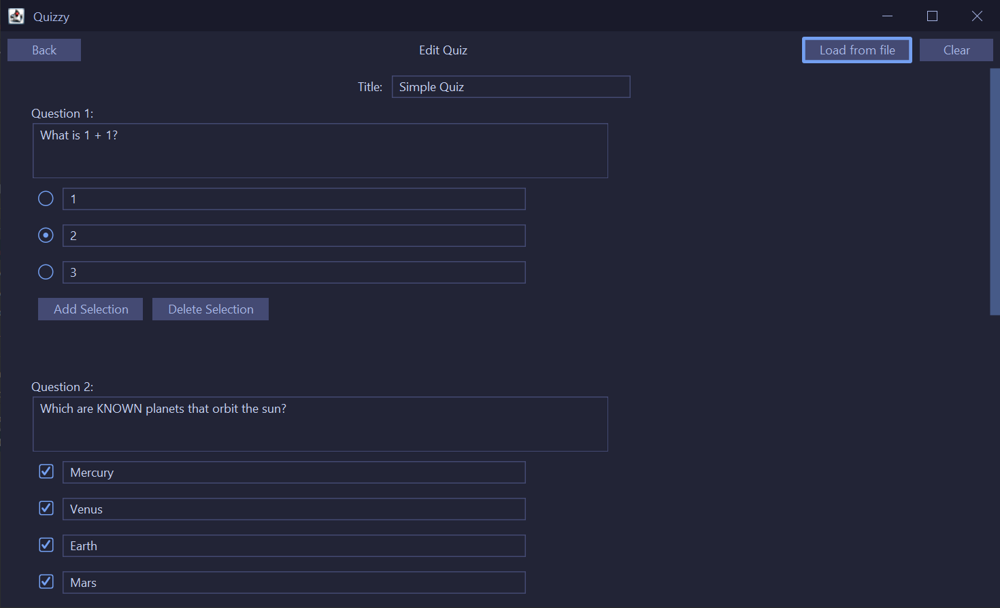
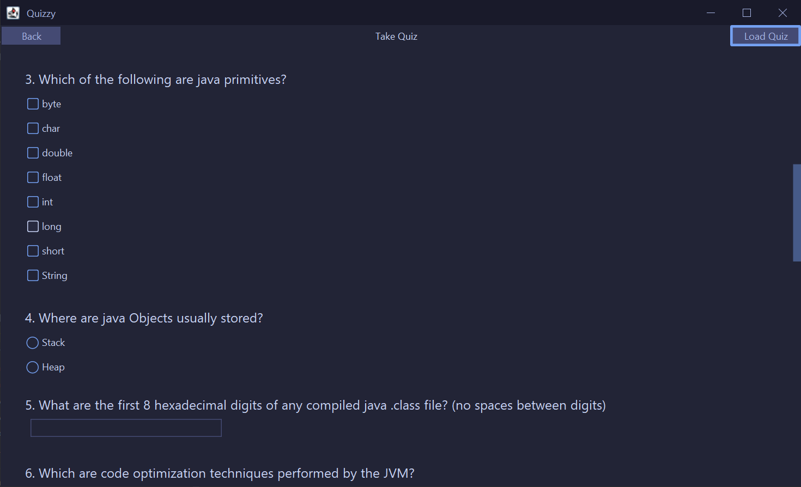
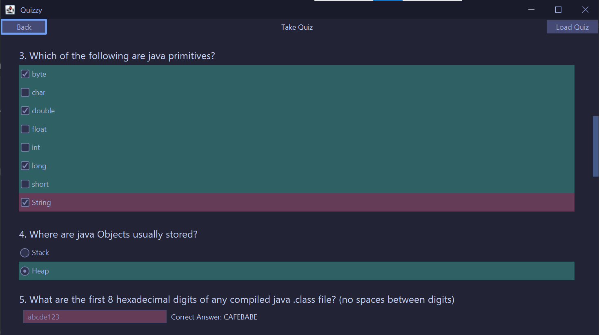

# Quizzy
An app for students to create, edit, and take quizzes

## To run

First, clone this project
```
git clone https://github.com/ericyuxuanye/quiz-app.git
```
On Mac/linux
```
./mvnw compile exec:java
```
On Windows
```
.\mvnw.cmd compile exec:java
```

## Jar file

To create a jar file with dependencies,

On Mac/linux
```
./mvnw assembly:assembly
```
On Windows
```
.\mvnw.cmd assembly:assembly
```
To run jar file:

```
java -jar target/Quizzy-1.0-SNAPSHOT-jar-with-dependencies.jar
```

# Screenshots



